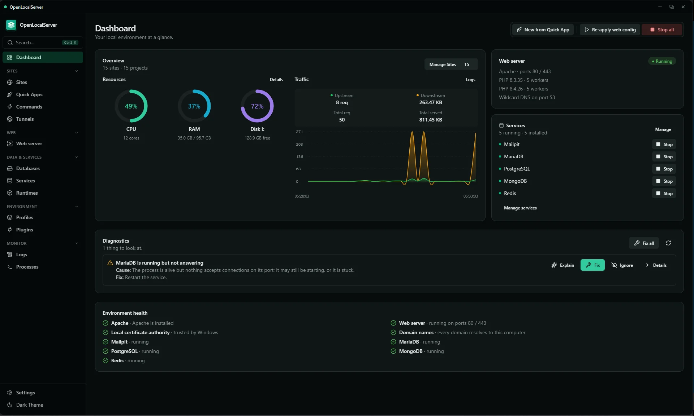
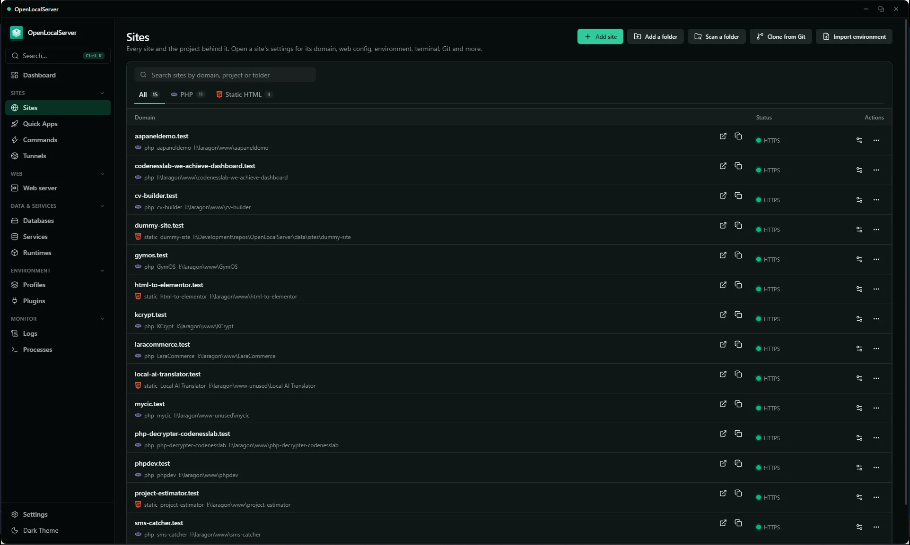
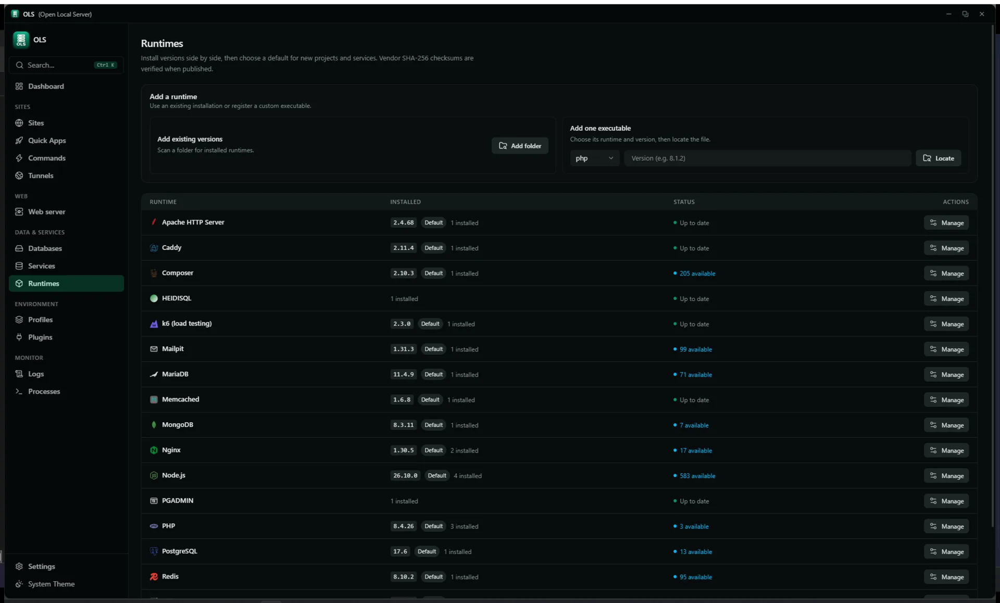
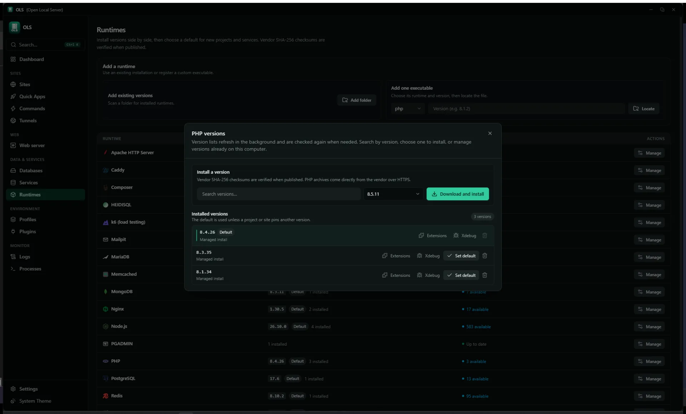
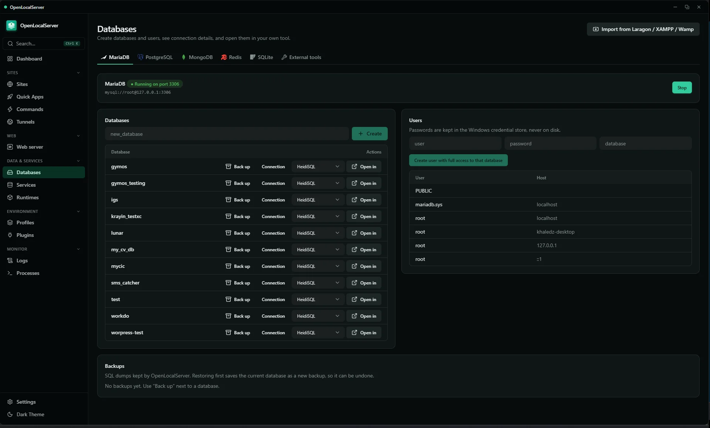
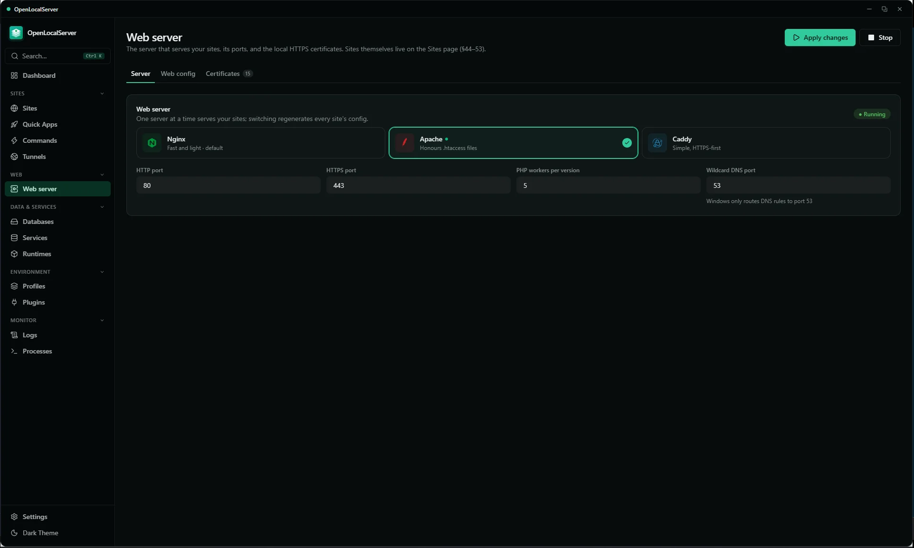
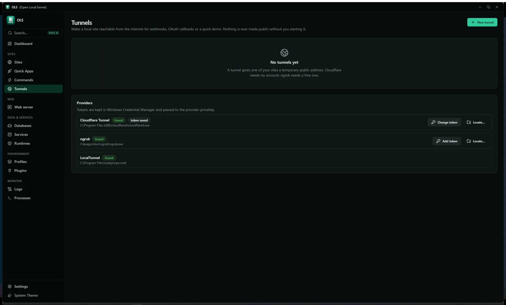

# OLS (Open Local Server)

> A free, open-source local development environment manager for Windows — runtimes, sites, databases, and trusted HTTPS, without touching your system by hand.

[](https://github.com/kz370/OpenLocalServer/actions)
[](./CHANGELOG.md)
[](./docs/STATUS.md)
[](./LICENSE)
[](./src-tauri/tauri.conf.json)
[](./crates/ols-core)

**OLS** (Open Local Server) is an all-in-one local development environment for Windows with broad runtime coverage and full extensibility. Every project gets isolated runtimes, its own `.test` domain, and trusted local HTTPS. One core engine (`ols-core`) powers three front doors: desktop GUI, CLI (`olsc`), and local HTTP API.

**Free, open source, and no limit on the number of sites.**

## Why I built it

I found plenty of free tools, but none of them had everything I wanted in one place. So I built one that does, first of all for myself. It is not made for profit, just to have the tool I wanted and to share it. It is and will stay completely free.

It is still in the early stages, so expect rough edges. Feedback and bug reports are very welcome.

## Contents

- [Download](#-download) · [Tour](#tour) · [Runtimes](#runtimes--toolchain) · [Sites & HTTPS](#sites-web-servers--https) · [Projects](#projects--reproducible-environments) · [Databases & Services](#databases--services) · [Dashboard & Monitoring](#dashboard--monitoring) · [Sharing](#sharing--tunnels) · [Automation](#cli-api--automation)
- [Getting Started](#getting-started) · [Usage](#usage) · [Project Structure](#project-structure) · [Built for AI](#-built-for-ai-built-to-be-forked) · [Contributing](#contributing) · [Third-Party Notices](#-third-party-notices) · [License](#license)

---

## 📥 Download

Grab the latest installer from the [Releases page](https://github.com/kz370/OpenLocalServer/releases).

- **The app itself comes empty.** Nothing is bundled. From the interface you download only the runtimes, web servers, and databases you need, or point OLS to ones you already have.
- **SmartScreen:** the installer isn't code-signed yet, so Windows SmartScreen may show a warning. Click **More info**, then **Run anyway**.

---

## 📸 Tour

> Captured from running app (dark theme).

<p align="center">
  
  <br><em>Dashboard — health, services, diagnostics at a glance</em>
</p>

<p align="center">
  
  <br><em>Sites — domains, per-site PHP, HTTPS, reverse proxy</em>
</p>

<p align="center">
  
  <br><em>Runtimes — side-by-side versions and defaults</em>
</p>

<p align="center">
  
  <br><em>Version manager — install and manage versions per runtime</em>
</p>

<p align="center">
  
  <br><em>Databases — engines, users, backups</em>
</p>

<p align="center">
  
  <br><em>Web server — engine config and control</em>
</p>

<p align="center">
  
  <br><em>Tunnels — share a local site, inspect traffic</em>
</p>

---

## ✨ Features

### 📦 Runtimes & Toolchain

- **Side-by-side versions** per runtime with a **version manager** dialog: search, install, default badge, per-version path display.
- **Managed lineup:** PHP NTS 8.1–8.5 (per-version extensions, Xdebug per version, PECL), Node 22/24 (corepack npm/pnpm/yarn), Composer, Python venvs, portable Git, k6 (load testing).
- **Online catalogs** per runtime (vendor sources, 24h cache, background refresh) + **SHA-256 verified** downloads, resume-safe cache, atomic extract.
- **Bring your own:** scan a folder for existing PHP installs, or register one executable (PHP/Node/Python) by locating the file.
- **Resolution order:** project manifest pin > auto-detected > global default. Changing a default never touches project files.

### 🌐 Sites, Web Servers & HTTPS

- **Add a site from inside the app:** pick a folder, add a **root folder** so every project inside it becomes a site automatically, or add one straight from a **Git repository**.
- **Unlimited sites.** Any domain + wildcard subdomains; automatic `<folder>.test`; static sites; **reverse proxy** to any host:port. Run on a domain, on localhost, or both at the same time.
- **Trusted local HTTPS:** on-device CA, 397-day leaf certs, auto-renew under 30 days, SAN-aware reuse.
- **Per-site PHP version and per-site web server:** each site can run on its own PHP version and its own server (Nginx, Apache, or Caddy); unpinned sites follow the global default.
- **Nginx 1.28 / Apache 2.4 / Caddy 2.11** with generated configs; Managed / Advanced / Manual modes; validate-before-reload with rollback; **drift detection**; config history with diff + restore.
- Built-in **wildcard DNS** for `.test` / `.localhost` / `.internal`; optional elevated helper for hosts/NRPT (no repeated UAC prompts).

### 🧩 Projects & Reproducible Environments

- **Auto-detection:** framework + version from `composer.json`, `package.json`, `manage.py`, markers; workspace scan.
- **Manifests** (`.openlocalserver/*.yaml`): environment, services, commands, lock file.
- **14-step setup pipeline:** resolve → plan → conflict report → dry-run → apply, journaled with **rollback** and file lock.
- **Profiles** (Development / Testing / Debugging / Demo), **snapshots and backups** (zip, clone, import/export), `.env` lossless editor (comments/order/CRLF preserved).
- **Quick Apps:** 13 built-in recipes (Laravel, Symfony, WordPress, Express, React/Vite, Vue, Next.js, Django, FastAPI, static…) — validate → plan review → run with history.
- **Quick Commands + project commands:** discovered Composer/npm scripts with one-click run and output ring, plus ready-made commands for Laravel, Node, and Python projects.

### 🗄️ Databases & Services

- **Engines:** MariaDB 11.4 (per-series data folders), PostgreSQL 17, MongoDB, Redis (`redis-windows`), Memcached, Mailpit, SQLite.
- Per-engine **DB + user management**, connection details, **backup/restore** (safety copy first), SQLite `.backup` + integrity checks.
- **One-click external GUIs:** HeidiSQL, pgAdmin 4, NoSQLBooster, Tiny RDM (auto-detected, Redis URI copy).
- **Importers:** Laragon / XAMPP / WampServer databases without SQL dumps (live-dump importer).
- Service lifecycle with TCP health, Mailpit mail capture per framework (`.env` planner with diff preview).
- **Resource limits per service:** cap RAM, CPU, and process count for each service, plus engine settings such as the MariaDB buffer pool.

### 📊 Dashboard & Monitoring

- **Services card:** all built-ins in a fixed order — start/stop/restart/reload/logs colour-coded per action, and anything unavailable right now shown flat grey instead of looking clickable. In a narrow window the **Web server** card moves above Overview; side by side it sits above Services.
- **Ports tab:** one aligned row per server (icon, name, HTTP, HTTPS, site count) with fixed-width port fields sized to five digits; a server that is the default shows its 80/443 fields locked rather than editable.
- **Number fields:** ports, worker counts, memory limits and IDE ports all use an in-app stepper (rounded chevrons, app palette, arrow keys work) rather than the browser's default arrows.
- **Overview:** sites/projects counts, resource donuts (CPU/RAM/disk), **traffic graph** from web access log (30-bucket, hover inspector).
- **Diagnostics card:** findings as Problem/Cause/Fix, safe one-click **auto-repair**, ignore list, AI explain per finding.
- **Doctor:** full report + repair planner; every error is `Diagnostic{problem, cause, fix}`.
- **Logs page:** unified severity-aware viewer (search/filter/export/clear); send logs to the AI assistant to explain an error. **Processes page:** raw process manager + system stats; per-site usage rollups.
- Command palette (`Ctrl+Shift+P`), global search (`Ctrl+K`).

### 🔗 Sharing & Tunnels

- Providers: **Cloudflare, ngrok, LocalTunnel, Tailscale** (abstraction + confirm gate). LocalTunnel needs no account, though it doesn't always work.
- **Exposure confirmation**, optional password, public badge, one-click stop.
- **Traffic inspector:** forwarding proxy, redacted log (500 cap), replay, webhook tester.

**Provider binaries are found, not installed.** Put the program on `PATH` or in a
known location before starting a tunnel:

```powershell
winget install --id Cloudflare.cloudflared   # cloudflared -> <prefix>.trycloudflare.com
winget install --id ngrok.ngrok               # ngrok     -> needs an authtoken
```

- Searched: anything on `PATH`, plus `C:\Program Files\cloudflared\` and
  `C:\Program Files (x86)\cloudflared\`.
- ngrok additionally needs its authtoken saved in the app (Tunnels → ngrok →
  token); it is kept in Windows Credential Manager, never in a file or log.
- The inspector captures normal HTTP requests only. WebSocket upgrades and
  streamed/chunked responses pass through without being logged, replayed or fed
  to the webhook tester.

### 🤖 CLI, API & Automation

- **CLI (`olsc`):** `setup [--dry-run] | doctor | repair | status | start | stop`, plus `project | runtime | service | tunnel | worker | snapshot | quick-command | search`; background **daemon** keeps working with GUI closed.
- **Local HTTP API** (`127.0.0.1:7420`): same `CoreCommand` JSON, bearer token, origin reject, read-only vs operate scopes.
- **Workers** (queue registry, max 16, Procfile.dev import), **scheduled tasks** (cron, 1-min tick, no overlap), **terminal** (portable-pty shells with runtime PATH-first, max 8).
- **Git manager:** status/stage/commit/branches/pull/push/remotes/stash/clone with credential helper.
- **k6 load testing** (VU cap, JSON metrics), **AI assistant** (runs locally with LM Studio, or connect Hugging Face / OpenRouter / any OpenAI-compatible provider) with scoped permissions.
- **Plugins:** declarative `plugin.yaml` (runtimes, quick apps, detections, health checks) via **minisign-signed catalogs**, re-verified each load.
- **Self-updater** (signed `latest.json` + SHA check), tray icon, notifications, start with Windows, leftover-server cleanup, memory limits. See [docs/PLUGINS.md](./docs/PLUGINS.md), [docs/API.md](./docs/API.md), [docs/AI_ASSISTANT.md](./docs/AI_ASSISTANT.md).

---

## 🚀 Getting Started

Most people only need the installer from the [Download](#-download) section. The steps below are for building from source.

### Prerequisites

| Requirement | Version | Notes |
|---|---|---|
| Windows | 10 / 11 (64-bit) | Windows-only |
| Rust | stable | `rustup` toolchain |
| Node.js | 22+ | UI build |
| Tauri prerequisites | — | WebView2, MSVC, WiX — see [Tauri prerequisites](https://tauri.app/start/prerequisites/) |

### Install dependencies

```powershell
# Rust toolchain (if missing)
winget install Rustlang.Rustup

# Node 22 (if missing)
winget install OpenJS.NodeJS.LTS --version 22

# UI dependencies
cd ui
npm install
```

### Run locally (dev)

```powershell
# From repo root — starts Tauri + Vite + Rust core
.\scripts\dev.bat
```

This launches the desktop app with hot-reload (Vite on `http://localhost:1420`).

### Build for production

```powershell
# Core + helper checks
cargo fmt --all
cargo clippy -p ols-core -p ols-helper --all-targets
cargo test -p ols-core -p ols-helper

# UI lint + build
cd ui
npm run lint
npm run build

# Tauri bundle (NSIS/MSI)
cd ..
cargo tauri build
```

---

## 💻 Usage

### Register a project and go live

```powershell
# Clone any PHP / Node / Python project
git clone https://github.com/example/my-laravel-app.git
cd my-laravel-app

# Full environment setup: runtimes → DB → domain → DNS → SSL → mail → workers
olsc setup

# Preview plan without applying
olsc setup --dry-run

# Check health, auto-fix safe issues
olsc doctor
olsc repair
```

### Daily commands

```powershell
olsc status                  # services, sites, runtimes
olsc start                   # start all enabled services
olsc stop                    # stop all

olsc project list            # registered projects
olsc service list            # MariaDB, Postgres, Redis, Mailpit…
olsc runtime list            # installed PHP/Node versions

olsc tunnel start --provider cloudflared --port 443
olsc worker run --queue default
olsc snapshot create --name "before-upgrade"
olsc search "mailpit"        # global search
```

### Typical flow in GUI

1. **Add project** — register or scan a folder, or add from a Git repository → framework auto-detected
2. **Setup** — review 14-step plan → Apply (rollback on failure)
3. **Open site** — `https://myapp.test` with trusted cert, per-site PHP
4. **Develop** — `.env` editor, terminal, Git tab, logs, Mailpit for mail
5. **Share** — tunnel with confirmation → inspector → one-click stop

> All errors surface as `Diagnostic{ problem, cause, fix }` — what broke, why, and how to fix it.

---

## 📁 Project Structure

```text
OpenLocalServer/
├── crates/
│   ├── ols-core/        # All logic — CoreCommand dispatcher (~150-200 variants),
│   │                    # managers: Runtime, Service, Web, Domain, Certs, Project,
│   │                    # ProcessSupervisor, Workers, Scheduler, Tunnel, Mail,
│   │                    # Diagnostics, QuickApp, Plugin
│   ├── ols-helper/      # Elevated helper — hosts/NRPT/service via UAC or
│   │                    # LocalSystem named pipe (closed validated set)
│   └── ols-cli/         # CLI (`olsc.exe` beside the app) — drives the app or a background daemon
├── src-tauri/           # Tauri 2 shell — window, tray, single IPC `run_command`
├── ui/src/              # React 19 + Vite 8 + Tailwind 4 + shadcn/ui,
│   │                    # CodeMirror 6, xterm.js, `core.ts` IPC wrapper
│   ├── pages/           # Dashboard, Sites, Environment, Git, Workers,
│   │                    # Snapshots, Tunnels, Profiles, Repair, Doctor…
│   └── components/      # shadcn/ui primitives, dialogs, editors
├── data/                # SQLite app database (app.db),
│                        # OLS_HOME env overrides all paths
├── docs/                # STATUS.md, IMPLEMENTATION_PLAN.md, AI_ASSISTANT.md…
├── specs/               # Single source of truth — architecture, catalog,
│                        # relationships, data models, API reference, diagrams
├── installer/          # Inno Setup script (open-local-server.iss)
├── scripts/            # dev.bat, build-installer.bat, upload-release.bat
├── assets/              # App icons + README screenshots (dashboard, sites,
│                        # runtimes, version-manager, databases, webserver,
│                        # tunnels — all .webp)
└── OLS_Master_SRS_v4.md  # Full requirements spec (v4)
```

**Architecture (one core, many front doors):**

```text
GUI (React) ──┐
CLI (olsc) ────┼──> Core::dispatch(CoreCommand) -> Inner (Arc-shared state)
HTTP API ─────┘         |
                        v
              Managers: Runtime, Service, Web, Domain, Certs,
              Project, ProcessSupervisor, Workers, Scheduler,
              Tunnel, Mail, Diagnostics, QuickApp, Plugin
```

---

## 🤖 Built for AI, built to be forked

The whole project is documented so an AI agent can understand it and keep building it:

- [`specs/`](./specs) is the single source of truth: architecture, catalog, data models, API reference, diagrams.
- [`AGENTS.md`](./AGENTS.md) tells an agent how the project works, what to do, and what to avoid.
- [`docs/`](./docs) and the [Master SRS](./OLS_Master_SRS_v4.md) explain the plan and the requirements.

Fork it, point your own AI agent (Claude Code, Cursor, or any other) at the repo, and turn it into the tool you want.

---

## 🤝 Contributing

Contributions welcome. Please read [CONTRIBUTING.md](./CONTRIBUTING.md) and the [Code of Conduct](./CODE_OF_CONDUCT.md) first.

```powershell
# Quality gates — must pass before PR
cargo fmt --all
cargo clippy -p ols-core -p ols-helper --all-targets
cargo test -p ols-core -p ols-helper
cd ui; npm run lint; npm run build
```

- **Specs-sync mandate:** `specs/` is source of truth. Any behavior change must update matching `specs/` files in same PR + append log line to `specs/runtime.md`. Behavior PR without spec update gets rejected. See [AGENTS.md](./AGENTS.md).
- **Safety:** user errors use `Diagnostic{problem,cause,fix}` · downloads verify SHA-256 · secrets in OS keyring only, never logs/files/bundles.
- **Commits:** Conventional Commits (`feat:`, `fix:`, `docs:` …).

---

## 🧾 Third-Party Notices

olsc is GPL-3.0-only (see [LICENSE](./LICENSE)).

**The installer ships OLS only — no third-party software is bundled.** Runtimes, web servers, and databases are downloaded by you on demand from the vendor and SHA-256 verified, and are installed into OLS-managed folders you can delete at any time. Tunnel binaries are neither downloaded nor installed — OLS only finds them already on your `PATH` (see [Tunnels](#-sharing--tunnels)).

### Downloaded on demand (NOT part of the installer)

| Component | License | Source |
| :--- | :--- | :--- |
| PHP (NTS 8.1–8.5) | PHP License 3.01 | windows.php.net |
| Composer | MIT | getcomposer.org |
| Node.js 22 / 24 | MIT | nodejs.org |
| corepack / npm / pnpm / yarn | MIT | nodejs.org |
| Portable Git | GPL-2.0-only | git-scm.com/downloads |
| Python | PSF License | python.org |
| k6 | AGPL-3.0-only | grafana.com/docs/k6 |
| Nginx 1.28 | BSD-2-Clause | nginx.org |
| Apache httpd 2.4 | Apache-2.0 | httpd.apache.org |
| Caddy 2.11 | Apache-2.0 | caddyserver.com |
| MariaDB 11.4 | GPL-2.0-only | mariadb.org |
| PostgreSQL 17 | PostgreSQL License | postgresql.org |
| MongoDB | SSPL-1.0 | mongodb.com |
| Redis (`redis-windows`) | RSALv2 / SSPLv1 | redis.io |
| Memcached | BSD-3-Clause | memcached.org |
| Mailpit | MIT | github.com/axllent/mailpit |
| HeidiSQL | GPL-3.0-only | heidisql.com |
| pgAdmin 4 | PostgreSQL License | pgadmin.org |
| NoSQLBooster | MIT | nosqlbooster.com |
| Tiny RDM | MIT | github.com/rvigster/TinyRDM |
| cloudflared | Apache-2.0 | github.com/cloudflare/cloudflared |
| ngrok | Apache-2.0 | github.com/ngrok/ngrok |
| localtunnel | MIT | github.com/localtunnel/localtunnel |
| Tailscale | BSD-3-Clause | tailscale.com |

### Notes

- Everything above runs as a **separate process in a separate folder**, is never linked into the OLS binary, and is removed when you uninstall it. Each project license applies to its own install.
- Redis and MongoDB are source-available, not OSI-approved.
- Tunnel provider binaries (cloudflared, ngrok) are **found on `PATH`, never downloaded or installed** by OLS.
- Licenses come from upstream vendor metadata; re-verify at release time.

---

## 📄 License

GPL-3.0-only — see [LICENSE](./LICENSE). See [SECURITY.md](./SECURITY.md) for reporting policy.

Feel free to use the code, edit it, and make your own version.

---

<p align="center">
  Built with Rust · Tauri 2 · React 19 · Tokio
  <br>
  <a href="./docs/STATUS.md">Status</a> ·
  <a href="./docs/IMPLEMENTATION_PLAN.md">Implementation Plan</a> ·
  <a href="./OLS_Master_SRS_v4.md">Master SRS v4</a> ·
  <a href="./CONTRIBUTING.md">Contributing</a>
</p>
